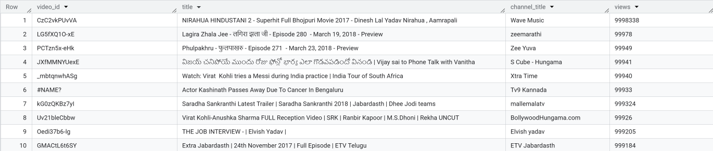
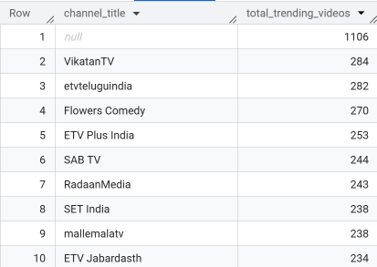
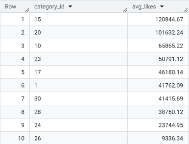
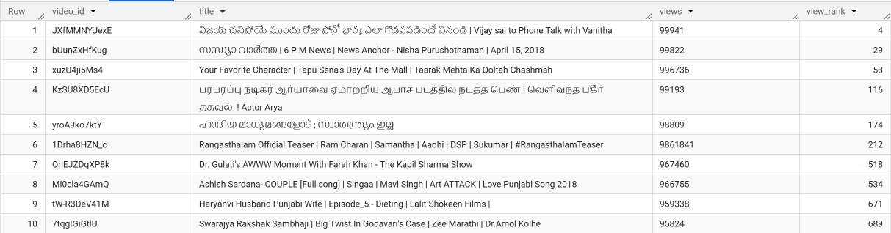

# 📊 YouTube Trending Videos Analysis using BigQuery

## 📌 Overview
This project analyzes trending YouTube videos in India using real-world data. The dataset was uploaded to Google BigQuery and explored using standard and advanced SQL techniques such as aggregation, filtering, and window functions.

---

## 🎯 Objectives
- Identify the top most-viewed videos
- Find which channels appear most frequently in trending
- Analyze audience engagement (likes) by category
- Use SQL `RANK()` to rank top-performing content

---

## 📁 Dataset
- Source: [YouTube Trending Videos Dataset (INvideos.csv)](https://www.kaggle.com/datasets/datasnaek/youtube-new)
- Table Name: `trending_videos`
- Upload Format: CSV to BigQuery

---

## 🧪 Tools Used
- Google BigQuery
- Standard SQL
- Kaggle for source data

---

## 🔍 SQL Tasks

### ✅ Task 1: Top 10 Most Viewed Videos

### ✅ Task 2: Channels with Most Trending Videos

### ✅ Task 3: Average Likes by Category

### ✅ Task 4: RANK() Over Views

---

## 📄 Files Included
- `queries.sql` – Contains all SQL queries used in the analysis
- `top10_videos.png` – Result from Task 1
- `top_channels.png` – Result from Task 2
- `avg_likes_by_category.png` – Result from Task 3
- `view_rank.png` – Result from Task 4

---

## 👨‍💻 Author

**Venu Gopal**  
📧 venugopalk9578@gmail.com  
🔗 [LinkedIn](https://www.linkedin.com/in/venugopal9578)

---

> ✅ This project was completed independently as part of my freelancing portfolio to demonstrate BigQuery and SQL proficiency.
